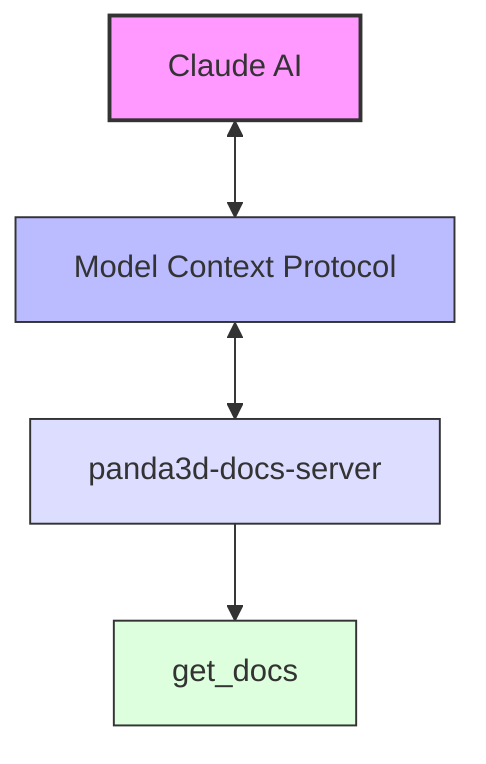

# Panda3D Documentation Server

A Model Context Protocol (MCP) server that enables Claude to search and retrieve Panda3D documentation seamlessly during conversations.

## Server Name

```txt
panda3d-docs-server
```

## What is Panda3D?

Panda3D is a powerful, open-source 3D game engine and rendering library. Originally developed by Disney and maintained by Carnegie Mellon University's Entertainment Technology Center, it provides:

- A complete framework for 3D rendering, physics, animation, and game development
- Python and C++ APIs for development flexibility
- Cross-platform support (Windows, macOS, Linux)
- Advanced features like shader support, scene graph architecture, and collision detection

Panda3D is used in both commercial games and academic research projects, making it a valuable tool for game developers, researchers, and students.

## What This Server Does

This MCP server serves as a bridge between Claude and the official Panda3D documentation. It:

1. Receives documentation queries from Claude through the Model Context Protocol
2. Uses Puppeteer to search the official Panda3D documentation website
3. Parses and extracts relevant information from search results
4. Returns formatted documentation content back to Claude

Under the hood, the server:

- Launches a headless browser using Puppeteer
- Performs searches on the Panda3D documentation site (<https://docs.panda3d.org>)
- Extracts search results and detailed content
- Formats the information for optimal readability in Claude
- Provides both a summary of search results and in-depth documentation

## Why did I create this?

The Panda3D documentation is one of the largest monsters I've ever had the misfortune of coming across so I use Claude frequently to scrape it.

also probably why the higher level Ursina project (built on panda3d) exists in the first place.

## MCP Tools



| Tool Name | Description | Parameters |
|-----------|-------------|------------|
| `get_docs` | Searches Panda3D documentation and returns formatted results | `query`: Search term<br>`check_keywords`: Search in module names (default: true)<br>`search_contents`: Search docstrings (default: false) |

## Prerequisites

- Node.js (v16 or higher)
- npm (v7 or higher)

## Installation

### Option 1: NPX (Easiest)

Run directly with NPX:

```bash
npx panda3d-docs-server
```

### Option 2: Global Installation

```bash
npm install -g panda3d-docs-server
panda3d-docs-server
```

### Option 3: Clone and Build

1. Clone this repository:

   ```bash
   git clone https://github.com/yourusername/panda3d-docs-server.git
   cd panda3d-docs-server
   ```

2. Install dependencies:

   ```bash
   npm install
   ```

3. Build the server:

   ```bash
   npm run build
   ```

4. Run the server:

   ```bash
   npm start
   ```

## Configuration with Claude

### For Claude Desktop

Add the server configuration to your Claude Desktop config file:

**Windows**:
Edit `%APPDATA%\Claude\claude_desktop_config.json`

**macOS**:
Edit `~/Library/Application Support/Claude/claude_desktop_config.json`

#### Option 1: Using NPX (Recommended)

```json
{
  "mcpServers": {
    "panda3d-docs-server": {
      "command": "npx",
      "args": ["-y", "panda3d-docs-server"]
    }
  }
}
```

#### Option 2: Using Local Installation

```json
{
  "mcpServers": {
    "panda3d-docs-server": {
      "command": "node",
      "args": ["C:/path/to/panda3d-docs-server/build/index.js"]
    }
  }
}
```

### Using with SmitheryAI

If you're using SmitheryAI to manage your MCP servers:

```bash
npx @smithery/cli install panda3d-docs-server --client claude
```

## Usage

Once configured, you can ask Claude to search the Panda3D documentation:

```bash
@panda3d-docs-server get_docs query="ShowBase class"
```

Additional parameters:

- `check_keywords`: Search in module names and titles (default: true)
- `search_contents`: Search in docstrings and code (default: false)

Example with all parameters:

```bash
@panda3d-docs-server get_docs query="collision detection" check_keywords=true search_contents=true
```

Claude will return a formatted response including:

1. A list of search results with links
2. Detailed documentation for the most relevant result
3. Debug information for troubleshooting

## Usage Examples

This document provides examples of how to use the Panda3D Documentation Server with Claude.

### Basic Usage

To ask Claude to search for Panda3D documentation, use the following format:

```bash
@panda3d-docs-server get_docs query="your search term"
```

### Example Queries

#### Looking up a Class

```bash
@panda3d-docs-server get_docs query="NodePath"
```

This will return documentation about the NodePath class, which is one of the fundamental classes in Panda3D used to represent a node in the scene graph.

#### Searching for a Method

```bash
@panda3d-docs-server get_docs query="setPos"
```

This will return documentation about the setPos method, which is used to position objects in 3D space.

#### Finding Information about a Concept

```bash
@panda3d-docs-server get_docs query="collision detection"
```

This will return information about Panda3D's collision detection system.

#### Searching in Docstrings and Code

To search within function docstrings and code (not just titles):

```bash
@panda3d-docs-server get_docs query="particle effects" search_contents=true
```

This enables a more comprehensive search that looks within the content of the documentation.

### Advanced Usage

#### Controlling Search Behavior

You can control the search behavior with additional parameters:

```bash
@panda3d-docs-server get_docs query="shader" check_keywords=true search_contents=true
```

- `check_keywords`: Search in module names and titles (default: true)
- `search_contents`: Search in docstrings and code (default: false)

### Example Conversation Flow

Here's an example of how you might use the Panda3D Documentation Server in a conversation with Claude:

> **You**: I want to create a simple 3D scene in Panda3D. Where should I start?
> **Claude**: To create a simple 3D scene in Panda3D, you'd want to start with the ShowBase class, which initializes the 3D rendering pipeline. Let me get the documentation for you.
> **Claude**: @panda3d-docs-server get_docs query="ShowBase"

  Claude will search and display the ShowBase documentation

> **You**: How do I add a 3D model to my scene?
> **Claude**: You'd use the loader.loadModel method along with a NodePath. Let me get that documentation.
> **Claude**: @panda3d-docs-server get_docs query="loadModel"
> **Claude will search and display the loadModel documentation**
> **You**: How do I make my model move around?
> **Claude**: @panda3d-docs-server get_docs query="setPos setHpr interval"

  Claude will search and display documentation about positioning, rotation, and animation intervals

### Tips for Effective Searches

1. **Be specific**: Use class names, method names, or specific concepts when possible
2. **Use technical terms**: Panda3D-specific terminology will yield better results
3. **Combine related terms**: You can combine multiple related terms in a single query
4. **Enable content search**: Use `search_contents=true` for more comprehensive results
5. **Follow up**: If the initial results don't contain what you need, try reformulating your query

### Exploring Common Panda3D Topics

#### Core Concepts

```bash
@panda3d-docs-server get_docs query="scene graph"
@panda3d-docs-server get_docs query="coordinate system"
@panda3d-docs-server get_docs query="transforms"
```

#### 3D Models and Animation

```bash
@panda3d-docs-server get_docs query="model loading"
@panda3d-docs-server get_docs query="animation"
@panda3d-docs-server get_docs query="actor"
```

#### Physics and Collision

```bash
@panda3d-docs-server get_docs query="collision detection"
@panda3d-docs-server get_docs query="physics engine"
@panda3d-docs-server get_docs query="bullet physics"
```

#### User Input

```bash
@panda3d-docs-server get_docs query="event handling"
@panda3d-docs-server get_docs query="mouse input"
@panda3d-docs-server get_docs query="keyboard input"
```

#### Rendering and Effects

```bash
@panda3d-docs-server get_docs query="shaders"
@panda3d-docs-server get_docs query="lighting"
@panda3d-docs-server get_docs query="particle effects"
```

## Development

### Build

```bash
npm run build
```

### Watch Mode (for development)

```bash
npm run watch
```

### Debug with MCP Inspector

The MCP Inspector provides a web interface for debugging:

```bash
npm run inspector
```

Access the inspector in your browser at the URL provided in the console.

## Troubleshooting

### Common Issues

- **Search returns no results**: Check your query format and try more general terms
- **Browser initialization errors**: Make sure your system has a compatible browser for Puppeteer

## License

MIT

## Contributing

Contributions are welcome! Please feel free to submit a Pull Request.
